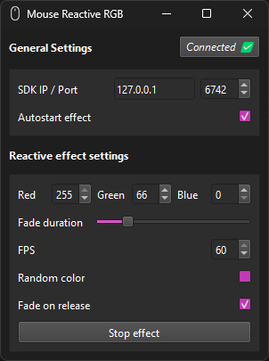

# MouseReactiveRGB

Reactive effect on mouse left / right button press.

Windows only.

Requires OpenRGB server running.

This is a personal project, far from perfect but enough for my use.

It will use the first detected mouse which supports direct mode.

Download latest release and run `MouseReactiveRGB.exe`. It will autoconnect to OpenRGB server if found.

You can then select desired color / duration. Settings are autosaved