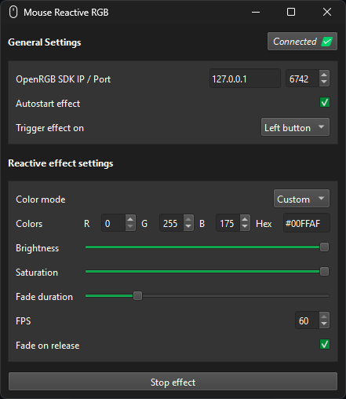

# MouseReactiveRGB

Reactive effect on mouse left / right button press.
This is a personal project, far from perfect but enough for my use.

Windows / Linux (x11 works, wayland untested)

## Requirements

- OpenRGB Server running (OpenRGB 0.9 only. 0.91 not working yet)

Download it manually from [openrgb.org](https://openrgb.org/releases.html) or install it with my [OpenRGB-Installer](https://github.com/Odizinne/OpenRGB-Installer/releases/latest) (Windows only)
- Direct mode compatible mouse

It will use the first detected mouse with direct mode support.

Mouse requirement is an arbitrary limitation, i just find it more logic to have mouse click reactive effect showing on a mouse rather than on a fan.  
It could work with any direct mode compatible device, feel free to edit the code to allow it.

Do not ever try to remove direct mode support limitation or you'll burn your controller flash.

## Download

Download latest [release](https://github.com/Odizinne/MouseReactiveRGB/releases/latest) and run `MouseReactiveRGB.exe`. It will auto connect to OpenRGB server if found or will wait for it to be available.
You can then select desired color / duration / fps.  
Settings are autosaved

If effect feels choppy on your device, try with lower FPS

Logitech G502 Hero and Razer Basilisk v3 are working flawlessly @60 FPS

## Credits

- [jath03](https://github.com/jath03/openrgb-python) for openrgb-python